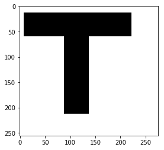

```python
import matplotlib.pyplot as plt
import matplotlib.image as mpimg
import numpy as np

image= plt.imread("resim3.png")
plt.imshow(image)
plt.show()
```





```python

def get_distance(v,w=[1/3,1/3,1/3]):
    a,b,c=v[0],v[1],v[2]
    w1,w2,w3=w[0],w[1],w[2]
    d=((a**2)*w1+(b**2)*w2+(c**2)*w3)**.5
    return d

```


```python
def convert_rgb_to_gray_level(im_1):
    m=im_1.shape[0]
    n=im_1.shape[1]
    im2=np.zeros((m,n))
    for i in range(m):
        for j in range(n):
            im2[i,j]=get_distance(im_1[i,j,:])
            
    return im2 
image1=convert_rgb_to_gray_level(image)
plt.imshow(image1,cmap="gray")
plt.show()
```


```python
def create_matrix():
    a = np.random.randint(2,size=784)
    a.resize(28,28)
    #np.random.shuffle(a)
    return a
print(create_matrix())

```

    [[1 1 0 1 0 1 1 1 1 1 0 1 1 0 0 0 0 1 1 1 1 1 1 1 1 0 0 1]
     [1 1 0 0 1 0 0 1 1 0 1 1 0 0 0 1 1 0 0 1 1 0 0 0 1 0 1 0]
     [0 1 0 0 0 1 0 1 0 0 0 0 0 0 1 1 1 1 1 1 0 0 1 0 1 1 1 0]
     [0 1 1 0 1 1 0 1 0 1 0 1 0 0 0 1 0 0 0 0 1 1 0 1 1 0 0 0]
     [1 1 0 1 0 1 1 1 1 0 0 0 0 1 1 1 1 1 1 1 0 0 1 0 1 1 0 0]
     [0 0 0 0 1 1 1 0 1 0 0 0 1 1 1 1 0 0 1 0 1 1 0 1 0 1 0 1]
     [1 0 1 0 1 1 1 0 1 1 0 1 1 0 0 1 0 0 1 0 0 0 1 0 1 0 1 0]
     [0 0 0 0 1 1 1 0 0 1 1 1 1 1 1 0 1 1 1 0 1 0 0 1 1 1 0 1]
     [0 0 0 1 1 1 0 0 1 0 1 1 1 1 0 1 0 0 1 0 1 1 1 1 0 0 0 1]
     [0 0 1 1 1 1 0 1 0 0 0 1 0 0 0 1 0 0 0 1 1 1 1 0 0 1 0 0]
     [0 1 1 1 1 0 1 0 0 1 1 0 0 0 1 0 0 1 0 1 1 0 0 1 0 0 0 1]
     [0 1 1 0 0 1 1 1 0 1 0 1 1 0 1 0 0 0 0 1 0 1 1 1 1 1 1 0]
     [0 0 0 0 1 1 1 0 0 0 0 1 1 0 0 1 0 0 1 0 1 0 1 0 0 0 0 1]
     [0 1 1 1 1 0 1 0 1 0 0 1 1 0 1 0 0 1 1 1 0 0 0 1 1 0 0 0]
     [1 0 0 0 0 1 0 0 1 0 0 1 1 1 1 0 0 1 1 0 1 0 1 0 0 1 1 0]
     [0 0 1 0 1 0 1 0 1 0 0 0 0 0 0 0 0 0 1 0 0 0 1 0 0 0 1 0]
     [1 1 1 0 1 1 0 0 1 1 0 1 0 1 1 0 0 1 0 1 0 1 0 0 0 1 0 1]
     [1 0 0 0 0 1 1 1 0 1 0 0 0 0 1 1 0 0 1 0 1 1 1 0 1 1 1 0]
     [1 1 0 1 0 1 0 1 1 0 0 0 1 0 1 0 0 1 1 1 0 1 0 0 0 0 0 0]
     [1 1 1 1 0 0 1 0 1 0 1 1 0 1 1 1 1 0 1 0 1 1 1 1 1 0 1 1]
     [1 1 0 1 0 0 0 1 1 1 1 1 1 1 0 0 1 0 1 0 1 0 0 1 1 1 1 0]
     [0 0 1 1 0 0 1 1 0 1 0 0 0 1 1 1 1 0 1 1 0 0 0 1 0 0 0 1]
     [1 1 1 0 0 1 1 1 0 1 1 0 0 1 0 0 0 0 1 1 0 0 1 0 0 1 1 0]
     [1 0 0 1 0 1 1 1 0 1 1 0 0 1 0 0 0 0 1 0 0 0 1 0 0 1 0 1]
     [0 0 0 1 0 1 1 0 0 0 1 1 0 0 1 0 0 0 1 1 1 0 1 0 1 0 0 0]
     [0 0 0 1 1 0 1 1 0 0 0 0 0 1 1 1 0 0 0 0 1 0 0 1 1 0 0 1]
     [1 1 1 0 1 0 0 1 0 1 0 0 0 0 1 0 0 0 0 0 0 1 1 0 0 1 0 0]
     [0 1 1 1 0 0 0 0 0 0 0 0 1 0 1 0 1 0 1 1 1 1 0 0 0 0 1 1]]
    


```python
def MBR_create_28_by_28_with_0_1(matrix_a):
    m=matrix_a.shape[0]
    n=matrix_a.shape[1]
    x_min=m
    x_max=0             #başlangıç değerleri olası en olumsuz durum
    y_min=n
    y_max=0
    for i in range(m):
        for j in range(n):
            if(matrix_a[i,j]==1 and x_min>i):            #resim matris üzerinden
                x_min=i
            if(matrix_a[i,j]==1 and x_max<i):
                x_max=i
            if(matrix_a[i,j]==1 and y_min>j):
                y_min=j
            if(matrix_a[i,j]==1 and y_max<j):
                y_max=j
    return(x_min,x_max,y_min,y_max)
    
```


```python
b=create_matrix()
print(MBR_create_28_by_28_with_0_1(b))
```

    (0, 27, 0, 27)
    


```python
def get_matrix_similarity(matrix_a, matrix_b):
    m=matrix_a.shape[0]
    n=matrix_a.shape[1]
    similarity=0
    for i in range(m):
        for j in range(n):
            similarity=similarity+matrix_a[i,j]*matrix_b[i,j]          
    return similarity
    
```


```python
s=get_matrix_similarity(create_matrix(),create_matrix())
print(s)
```

    212
    


```python
def get_matrix_100():
    
    matrix=create_matrix()
    first_matrix=[]
    for i in range(99):
        first_matrix.append(create_matrix())
    similar=[]
    for k in first_matrix:
        similar.append(get_matrix_similarity(matrix,k))
        
    return similar
print(get_matrix_100())
```

    [194, 186, 189, 189, 199, 195, 207, 179, 187, 198, 195, 180, 177, 188, 199, 186, 189, 204, 190, 199, 212, 209, 182, 190, 197, 180, 209, 194, 204, 177, 205, 198, 195, 204, 207, 193, 180, 180, 205, 211, 208, 194, 191, 180, 201, 189, 196, 191, 183, 185, 187, 183, 201, 197, 194, 187, 195, 209, 182, 204, 186, 214, 190, 197, 198, 178, 203, 188, 195, 202, 203, 188, 198, 198, 198, 204, 198, 176, 195, 177, 187, 200, 195, 199, 199, 182, 202, 190, 183, 194, 199, 199, 191, 182, 188, 204, 203, 186, 185]
    


```python
def get_similarity_for_100_characters(kac_karakter=100):
    characters=[]
    for i in range(kac_karakter):
        new_char=create_matrix()
        characters.append(new_char)
    for i in range(kac_karakter):
        benzerlik=get_matrix_similarity(characters[0],characters[i])
        print("0 --"+str(i)+"",benzerlik)
```


```python
get_similarity_for_100_characters(10)
```

    0 --0 378
    0 --1 180
    0 --2 194
    0 --3 189
    0 --4 190
    0 --5 171
    0 --6 192
    0 --7 176
    0 --8 194
    0 --9 202
    


```python

```
